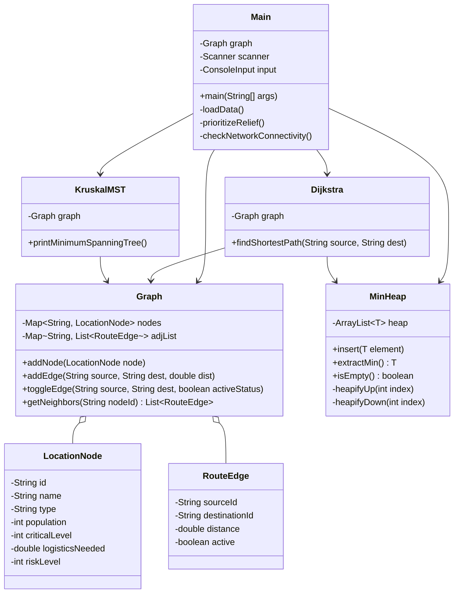
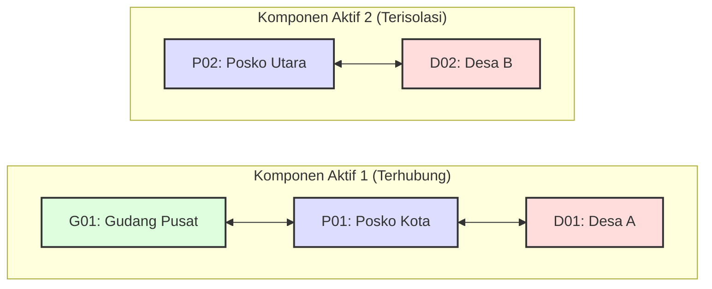

# Final Project - Opsi 8 : Disaster Relief Distribution Network

|               |           |
|---------------|-----------|
| **Topik**     | Opsi 8 — Disaster Relief Distribution Network |
| **Kelompok**  | 5 (Lima)  |
| **Matakuliah**| Struktur Data & Pemrograman Berorientasi Objek |
| **Tahun**     | 2026      |

---

# Struktur Repositori Proyek
Berikut adalah struktur direktori dari proyek *Disaster Relief Distribution Network*:
```text
FP_Strukdat_Kelompok05/
├── data/
│   ├── nodes.csv               # Dataset simpul lokasi (ID, Nama, Tipe, Populasi, Tingkat Kritis, dsb.)
│   └── edges.csv               # Dataset rute jalan antar lokasi beserta bobot jarak tempuh
├── docs/
│   ├── laporan.pdf             # Laporan formal pengumpulan
│   ├── screenshots/            # Dokumentasi visual running program
│   ├── testing.md              # Laporan pengujian skenario normal & edge case
│   └── tracing.pdf             # Dokumen penelusuran algoritma secara manual
├── src/
│   ├── model/
│   │   ├── LocationNode.java   # Representasi Simpul (Node) lokasi
│   │   └── RouteEdge.java      # Representasi Sisi (Edge) jalan raya
│   ├── tree/
│   │   └── MinHeap.java        # Implementasi Tree/Min-Heap kustom
│   ├── graph/
│   │   ├── Graph.java          # Representasi Graf dengan Adjacency List
│   │   ├── Dijkstra.java       # Komputasi Rute Tercepat (Shortest Path)
│   │   └── KruskalMST.java     # Komputasi Jaringan Distribusi Minimum (MST)
│   ├── util/
│   │   └── ConsoleInput.java   # Pustaka pembantu input konsol & validasi defensive
│   └── Main.java               # Titik masuk utama program CLI interaktif
└── README.md                   # Ringkasan informasi proyek dan cara instalasi
```

---

# Pendahuluan & Latar Belakang Masalah
Dalam penanganan bencana alam, keberhasilan evakuasi dan pengiriman logistik medis/makanan sangat bergantung pada efisiensi jaringan distribusi. Tantangan utama yang dihadapi meliputi infrastruktur jalan yang rusak akibat bencana susulan, alokasi armada yang terbatas, serta keharusan menetapkan prioritas bagi lokasi-lokasi yang paling kritis. 

Untuk memodelkan dan menyelesaikan masalah tersebut secara terprogram, sistem ini menggunakan kolaborasi struktur data **Graph** (untuk memetakan jaringan jalan), **Tree/Min-Heap** (untuk antrean prioritas bantuan dan optimasi Dijkstra), serta algoritma optimasi graf (**Dijkstra** untuk rute tercepat dan **Kruskal** untuk perancangan jaringan jalan minimum).

---

# Representasi Visual Sistem

Berikut adalah hubungan antar-kelas dalam sistem distribusi logistik bantuan bencana ini:



---

# 1. Entitas Dasar (Node dan Edge)

Pemodelan jaringan jalan raya atau peta secara matematis membutuhkan **Graf (Graph)** yang terdiri dari Simpul (Node) dan Sisi/Garis (Edge).

### A. Simpul Peta (`LocationNode.java`)
`LocationNode` merepresentasikan titik-titik fisik di lapangan seperti Posko, Desa, atau Gudang Pusat.

**Cuplikan Kode Lengkap:**
```java
package model;

public class LocationNode {
    private String id;
    private String name;
    private String type; // "Gudang", "Posko", "Desa"
    private int population;
    private int criticalLevel; // 1 (Low) to 5 (High)
    private double logisticsNeeded; // in tons
    private int riskLevel; // 1 (Low) to 5 (High)

    public LocationNode(String id, String name, String type, int population, int criticalLevel, double logisticsNeeded, int riskLevel) {
        this.id = id;
        this.name = name;
        this.type = type;
        this.population = population;
        this.criticalLevel = criticalLevel;
        this.logisticsNeeded = logisticsNeeded;
        this.riskLevel = riskLevel;
    }

    public String getId() { return id; }
    public String getName() { return name; }
    public String getType() { return type; }
    public int getPopulation() { return population; }
    public int getCriticalLevel() { return criticalLevel; }
    public double getLogisticsNeeded() { return logisticsNeeded; }
    public int getRiskLevel() { return riskLevel; }

    public void setLogisticsNeeded(double logisticsNeeded) {
        this.logisticsNeeded = logisticsNeeded;
    }

    @Override
    public String toString() {
        return id + " - " + name + " (" + type + ")";
    }
}
```

**Analisis & Alasan Desain Node:**
- Objek ini didesain kaya informasi (rich attributes) untuk menampung data kebencanaan selain sekadar nama tempat.
- Atribut-atribut ini (`criticalLevel`, `riskLevel`, `logisticsNeeded`, `population`) bersifat kuantitatif agar dapat dihitung secara matematis menjadi **Skor Emergensi/Darurat** komposit untuk sistem antrean prioritas bantuan.

---

### B. Jalur Penghubung (`RouteEdge.java`)
`RouteEdge` merepresentasikan jalan raya (rute) yang menghubungkan satu lokasi dengan lokasi lainnya.

**Cuplikan Kode Lengkap:**
```java
package model;

public class RouteEdge {
    private String sourceId;
    private String destinationId;
    private double distance; // weight in km
    private boolean active; // true if road is accessible, false if broken/blocked

    public RouteEdge(String sourceId, String destinationId, double distance) {
        this.sourceId = sourceId;
        this.destinationId = destinationId;
        this.distance = distance;
        this.active = true;
    }

    public String getSourceId() { return sourceId; }
    public String getDestinationId() { return destinationId; }
    public double getDistance() { return distance; }
    public boolean isActive() { return active; }

    public void setActive(boolean active) {
        this.active = active;
    }

    @Override
    public String toString() {
        return sourceId + " -> " + destinationId + " : " + distance + " km (" + (active ? "Active" : "Blocked") + ")";
    }
}
```

**Analisis & Alasan Desain Edge:**
- Objek ini merupakan representasi **Sisi Berbobot (Weighted Edge)** dengan bobot berupa `distance` (jarak dalam kilometer). Bobot inilah yang diminimalkan oleh algoritma Dijkstra dan Kruskal.
- Poin krusial di sini adalah keberadaan atribut `boolean active`. Dalam kondisi bencana alam, jalan raya dapat tertimbun longsor atau jembatan runtuh secara tiba-tiba. Dengan atribut `active`, status jalan dapat diubah secara dinamis tanpa harus menghapus objek tersebut dari graf. Hal ini memungkinkan simulasi pemutusan dan pemulihan jalur transportasi secara instan.

---

# 2. Struktur Data Graf: Peta Jaringan (`Graph.java`)

Peta jaringan logistik direpresentasikan sebagai **Graf Tidak Berarah (Undirected Graph)** karena jalan raya dua arah memungkinkan truk bantuan melintas bolak-balik dari simpul A ke B maupun sebaliknya.

**Cuplikan Kode Lengkap:**
```java
package graph;

import model.LocationNode;
import model.RouteEdge;

import java.util.*;

public class Graph {
    private Map<String, LocationNode> nodes;
    private Map<String, List<RouteEdge>> adjList;

    public Graph() {
        nodes = new HashMap<>();
        adjList = new HashMap<>();
    }

    public void addNode(LocationNode node) {
        nodes.put(node.getId(), node);
        adjList.putIfAbsent(node.getId(), new ArrayList<>());
    }

    public boolean addEdge(String sourceId, String destId, double distance) {
        if (!nodes.containsKey(sourceId) || !nodes.containsKey(destId)) {
            System.out.println("Error: Salah satu node tidak ditemukan.");
            return false;
        }

        if (hasEdge(sourceId, destId)) {
            System.out.println("Jalur " + sourceId + " - " + destId + " sudah ada. Duplikasi edge dibatalkan.");
            return false;
        }
        
        // Graf Tidak Berarah (Undirected)
        adjList.get(sourceId).add(new RouteEdge(sourceId, destId, distance));
        adjList.get(destId).add(new RouteEdge(destId, sourceId, distance));
        return true;
    }

    public boolean hasEdge(String sourceId, String destId) {
        for (RouteEdge edge : adjList.getOrDefault(sourceId, new ArrayList<>())) {
            if (edge.getDestinationId().equals(destId)) {
                return true;
            }
        }
        return false;
    }

    public void toggleEdge(String sourceId, String destId, boolean activeStatus) {
        boolean found = false;
        for (RouteEdge edge : adjList.getOrDefault(sourceId, new ArrayList<>())) {
            if (edge.getDestinationId().equals(destId)) {
                edge.setActive(activeStatus);
                found = true;
            }
        }
        for (RouteEdge edge : adjList.getOrDefault(destId, new ArrayList<>())) {
            if (edge.getDestinationId().equals(sourceId)) {
                edge.setActive(activeStatus);
                found = true;
            }
        }
        if (found) {
            System.out.println("Jalur " + sourceId + " - " + destId + " statusnya menjadi: " + (activeStatus ? "AKTIF" : "RUSAK/TERTUTUP"));
        } else {
            System.out.println("Jalur tidak ditemukan.");
        }
    }

    public Map<String, LocationNode> getNodes() {
        return nodes;
    }

    public List<RouteEdge> getNeighbors(String nodeId) {
        return adjList.getOrDefault(nodeId, new ArrayList<>());
    }
    
    public Map<String, List<RouteEdge>> getAdjList() {
        return adjList;
    }

    public void printGraph() {
        System.out.println("\n\u001B[36m\u001B[1m=== Peta Jaringan Distribusi Saat Ini ===\u001B[0m");
        
        List<String> sortedIds = new ArrayList<>(adjList.keySet());
        Collections.sort(sortedIds);

        for (String id : sortedIds) {
            LocationNode node = nodes.get(id);
            System.out.printf("\u001B[33m\u001B[1m[%s]\u001B[0m %s (%s)\n", id, node.getName(), node.getType());
            
            List<RouteEdge> edges = adjList.get(id);
            if (edges == null || edges.isEmpty()) {
                System.out.println("    \u001B[31m(Tidak terhubung ke mana pun)\u001B[0m");
            } else {
                for (int i = 0; i < edges.size(); i++) {
                    RouteEdge edge = edges.get(i);
                    LocationNode dest = nodes.get(edge.getDestinationId());
                    String connector = (i == edges.size() - 1) ? "└──" : "├──";
                    
                    if (edge.isActive()) {
                        System.out.printf("    %s \u001B[32m%s\u001B[0m [%s] -> \u001B[36m%.1f km\u001B[0m\n", 
                                connector, dest.getName(), dest.getId(), edge.getDistance());
                    } else {
                        System.out.printf("    %s \u001B[31m\u001B[9m%s\u001B[0m [%s] -> \u001B[31m[JALUR RUSAK/TERTUTUP]\u001B[0m\n", 
                                connector, dest.getName(), dest.getId());
                    }
                }
            }
            System.out.println();
        }
    }
}
```

### Analisis & Alasan Pemilihan Struktur Graf:
1. **Representasi Menggunakan Adjacency List (`Map<String, List<RouteEdge>>`)**:
   - Peta infrastruktur jalan raya dunia nyata bertipe **Graf Renggang (Sparse Graph)**. Maksudnya, jumlah relasi jalan raya antar kota/lokasi ($E$) jauh lebih sedikit dibandingkan kuadrat jumlah lokasinya ($V^2$). Rata-rata suatu posko atau desa hanya terhubung langsung dengan 2 hingga 4 lokasi tetangga.
   - Jika kita menggunakan **Adjacency Matrix** berukuran $V \times V$, kita akan membuang memori sebesar $O(V^2)$ secara percuma karena mayoritas sel matriks akan bernilai kosong (nol/null).
   - Dengan **Adjacency List**, kompleksitas ruang penyimpanan dapat dipangkas menjadi hanya $O(V + E)$, sehingga menghemat kapasitas RAM secara signifikan.
2. **Konektivitas Undirected**:
   - Pemetaan jalan dua arah mengharuskan metode `addEdge` menambahkan dua objek `RouteEdge` sekaligus secara berlawanan arah agar rute logistik dapat dihitung bolak-balik.
3. **Data Integrity via `hasEdge`**:
   - Fungsi `hasEdge` dipanggil sebelum penambahan sisi baru guna menghindari redundansi data jalan kembar pada simpul yang sama, menjaga kualitas data pada visualisasi dan keakuratan algoritma penelusuran.

---

# 3. Struktur Data Pohon: Min-Heap Kustom (`MinHeap.java`)

Min-Heap adalah struktur pohon biner lengkap (Complete Binary Tree) yang memenuhi **Heap Property**: nilai dari setiap simpul induk selalu lebih kecil atau sama dengan nilai dari simpul anak-anaknya. Akibatnya, elemen dengan nilai terkecil selalu terjamin berada di posisi akar (indeks 0).

**Cuplikan Kode Lengkap:**
```java
package tree;

import java.util.ArrayList;

public class MinHeap<T extends Comparable<T>> {
    private ArrayList<T> heap;

    public MinHeap() {
        this.heap = new ArrayList<>();
    }

    private int parent(int i) { return (i - 1) / 2; }
    private int leftChild(int i) { return 2 * i + 1; }
    private int rightChild(int i) { return 2 * i + 2; }

    public void insert(T element) {
        heap.add(element);
        heapifyUp(heap.size() - 1);
    }

    public T extractMin() {
        if (heap.isEmpty()) return null;
        if (heap.size() == 1) return heap.remove(0);

        T root = heap.get(0);
        heap.set(0, heap.remove(heap.size() - 1));
        heapifyDown(0);
        
        return root;
    }

    public boolean isEmpty() {
        return heap.isEmpty();
    }

    private void heapifyUp(int index) {
        while (index > 0 && heap.get(parent(index)).compareTo(heap.get(index)) > 0) {
            swap(parent(index), index);
            index = parent(index);
        }
    }

    private void heapifyDown(int index) {
        int smallest = index;
        int left = leftChild(index);
        int right = rightChild(index);

        if (left < heap.size() && heap.get(left).compareTo(heap.get(smallest)) < 0) {
            smallest = left;
        }

        if (right < heap.size() && heap.get(right).compareTo(heap.get(smallest)) < 0) {
            smallest = right;
        }

        if (smallest != index) {
            swap(index, smallest);
            heapifyDown(smallest);
        }
    }

    private void swap(int i, int j) {
        T temp = heap.get(i);
        heap.set(i, heap.get(j));
        heap.set(j, temp);
    }
    
    public int size() {
        return heap.size();
    }
}
```

### Analisis & Analisis Implementasi Heap:
- **Representasi Berbasis Array / List**: Heap diimplementasikan menggunakan `ArrayList` alih-alih struktur pohon ber-pointer fisik (seperti AVL Tree atau BST). Hal ini dikarenakan pohon biner lengkap dapat dipetakan secara sempurna ke dalam array linear dengan rumus matematika indeks:
  - $\text{parent}(i) = \lfloor\frac{i - 1}{2}\rfloor$
  - $\text{leftChild}(i) = 2i + 1$
  - $\text{rightChild}(i) = 2i + 2$
- **Operasi Efisien**:
  - `insert()` menempatkan elemen baru di ujung array, lalu menaikkannya ke posisi yang sesuai melalui `heapifyUp()` dengan kompleksitas **$O(\log N)$**.
  - `extractMin()` mengambil akar, menggantikannya dengan elemen terakhir, lalu menurunkannya menggunakan `heapifyDown()` dengan kompleksitas **$O(\log N)$**.
  
### Penerapan Ganda Struktur Min-Heap di Proyek Ini:
> [!NOTE]
> Struktur data `MinHeap` kustom ini memiliki peran ganda yang sangat strategis dalam memecahkan masalah sistem logistik:
>
> 1. **Prioritas Pengiriman Bantuan Teratas (Menu 6 - `prioritizeRelief`)**:
>    Meskipun kelas ini dinamai `MinHeap`, ia dimanfaatkan untuk memprioritaskan daerah dengan tingkat kedaruratan tertinggi (Skor Emergensi terbesar) dengan cara membalikkan logika pembanding (`compareTo`) pada kelas `Task`:
>    ```java
>    @Override
>    public int compareTo(Task o) {
>        // Membalikkan logika: o dibandingkan dengan this.
>        // Mengakibatkan nilai Skor Emergensi terbesar menempati posisi puncak Heap (berperan sebagai Max-Heap)
>        int scoreComparison = Double.compare(o.emergencyScore, this.emergencyScore);
>        ...
>    }
>    ```
>    Dengan trik desain ini, lokasi paling darurat dapat diakses secara instan dengan kompleksitas waktu $O(1)$ untuk melihat elemen puncak, dan reorganisasi antrean setelah bantuan dikirim dilakukan dalam $O(\log N)$.
>    
> 2. **Priority Queue untuk Algoritma Dijkstra (Menu 7 - `findShortestRoute`)**:
>    Dalam pencarian rute terpendek, `MinHeap` digunakan sesuai fungsi aslinya untuk mengambil simpul yang memiliki akumulasi jarak terpendek dari simpul asal. Hal ini memangkas kompleksitas pencarian simpul terdekat berikutnya dari linear $O(V)$ menjadi logaritmik $O(\log V)$.

---

# 4. Algoritma Pencarian Rute Tercepat: Dijkstra (`Dijkstra.java`)

Algoritma Dijkstra digunakan untuk mencari jalur terpendek dari satu titik awal (Single-Source Shortest Path) menuju titik tujuan. Komputasi rute ini wajib berjalan secara dinamis agar sensitif terhadap kondisi kerusakan jalan secara real-time.

```mermaid
flowchart TD
    %% Styling
    classDef init fill:#f9f,stroke:#333,stroke-width:2px;
    classDef process fill:#bbf,stroke:#333,stroke-width:2px;
    classDef decision fill:#ffb,stroke:#333,stroke-width:2px;
    classDef endNode fill:#fbb,stroke:#333,stroke-width:2px;
    
    subgraph Inisialisasi["1. Inisialisasi Jarak & Queue"]
        Start([Mulai Dijkstra]) --> SetDist[Set Jarak Semua Node = Infinity<br>Jarak Source = 0]
        SetDist --> PushHeap[Masukkan Source ke Min-Heap]
    end

    subgraph LoopDijkstra["2. Loop Utama & Evaluasi"]
        PushHeap --> CheckEmpty{Apakah Heap<br>Kosong?}
        CheckEmpty -- Ya --> PrintNoPath[Target Tidak Terjangkau]
        CheckEmpty -- Tidak --> PopMin[Ambil Node Terkecil<br>current = extractMin()]
        
        PopMin --> CheckTarget{Apakah current = Destination?}
        CheckTarget -- Ya --> Done[Rekonstruksi Jalur & Selesai]
        CheckTarget -- Tidak --> CheckStale{Jarak current > Jarak tercatat?}
        
        CheckStale -- Ya --> CheckEmpty
        CheckStale -- Tidak --> ExploreNeighbors["3. Iterasi Setiap Tetangga (Neighbor v)"]
    end

    subgraph NeighborExploration["4. Evaluasi & Relaksasi Sisi"]
        ExploreNeighbors --> CheckActive{Apakah Jalan<br> v Aktif?}
        CheckActive -- Tidak --> NextN[Abaikan: Cek Tetangga Berikutnya]
        CheckActive -- Ya --> CalcDist[Hitung Jarak Baru:<br>newDist = Jarak current + Bobot]
        
        CalcDist --> CheckRelax{Apakah newDist <br> Jarak Tercatat v?}
        CheckRelax -- Ya --> UpdateDist[Update Jarak Tercatat v & Previous Node<br>Masukkan v ke Min-Heap]
        CheckRelax -- Tidak --> NextN
        
        UpdateDist --> NextN
        NextN --> MoreN{Ada Tetangga<br>Lain?}
        MoreN -- Ya --> CheckActive
        MoreN -- Tidak --> CheckEmpty
    end

    class Start,Done,PrintNoPath endNode;
    class SetDist,PushHeap,PopMin,UpdateDist,CalcDist process;
    class CheckEmpty,CheckTarget,CheckStale,CheckActive,CheckRelax,MoreN decision;
```

**Cuplikan Kode Lengkap:**
```java
package graph;

import model.LocationNode;
import model.RouteEdge;
import tree.MinHeap;

import java.util.*;

public class Dijkstra {
    private Graph graph;

    public Dijkstra(Graph graph) {
        this.graph = graph;
    }

    private static class DijkstraNode implements Comparable<DijkstraNode> {
        String id;
        double distance;

        public DijkstraNode(String id, double distance) {
            this.id = id;
            this.distance = distance;
        }

        @Override
        public int compareTo(DijkstraNode other) {
            return Double.compare(this.distance, other.distance);
        }
    }

    public void findShortestPath(String sourceId, String destId) {
        Map<String, Double> distances = new HashMap<>();
        Map<String, String> previous = new HashMap<>();
        MinHeap<DijkstraNode> pq = new MinHeap<>();

        // Inisialisasi awal
        for (String id : graph.getNodes().keySet()) {
            distances.put(id, Double.MAX_VALUE);
        }

        distances.put(sourceId, 0.0);
        pq.insert(new DijkstraNode(sourceId, 0.0));

        while (!pq.isEmpty()) {
            DijkstraNode current = pq.extractMin();
            String currentId = current.id;

            // Optimasi: Hentikan loop jika target tujuan sudah tercapai
            if (currentId.equals(destId)) {
                break; 
            }

            // Abaikan node yang kedaluwarsa di dalam Priority Queue
            if (current.distance > distances.get(currentId)) {
                continue; 
            }

            for (RouteEdge edge : graph.getNeighbors(currentId)) {
                // SKIP JALUR RUSAK/TERTUTUP (Analisis Bencana Real-Time)
                if (!edge.isActive()) continue; 

                String neighborId = edge.getDestinationId();
                double newDist = distances.get(currentId) + edge.getDistance();

                // Proses Relaksasi Sisi
                if (newDist < distances.get(neighborId)) {
                    distances.put(neighborId, newDist);
                    previous.put(neighborId, currentId);
                    pq.insert(new DijkstraNode(neighborId, newDist));
                }
            }
        }

        printPath(sourceId, destId, distances, previous);
    }

    private void printPath(String sourceId, String destId, Map<String, Double> distances, Map<String, String> previous) {
        if (distances.get(destId) == Double.MAX_VALUE) {
            System.out.println("Tidak ada rute yang tersedia dari " + graph.getNodes().get(sourceId).getName() + " ke " + graph.getNodes().get(destId).getName());
            return;
        }

        List<String> path = new ArrayList<>();
        String curr = destId;
        while (curr != null) {
            path.add(curr);
            curr = previous.get(curr);
        }
        Collections.reverse(path);

        System.out.println("\n=== Rute Tercepat ===");
        System.out.println("Dari: " + graph.getNodes().get(sourceId).getName());
        System.out.println("Ke: " + graph.getNodes().get(destId).getName());
        System.out.printf("Total Jarak: %.1f km%n", distances.get(destId));
        System.out.print("Jalur: ");
        
        for (int i = 0; i < path.size(); i++) {
            System.out.print(graph.getNodes().get(path.get(i)).getName());
            if (i < path.size() - 1) {
                System.out.print(" -> ");
            }
        }
        System.out.println();
    }
}
```

### Analisis Cara Kerja Dijkstra pada Sistem Kedaruratan:
1. **Penggunaan MinHeap**: `pq.extractMin()` menjamin simpul yang memiliki akumulasi jarak terkecil akan diproses terlebih dahulu.
2. **Penyaringan Real-Time (`!edge.isActive()`)**: Baris `if (!edge.isActive()) continue;` adalah kecerdasan utama dalam sistem kebencanaan ini. Apabila suatu jalan dinonaktifkan via Menu 9, algoritma Dijkstra secara otomatis mengabaikan jalur tersebut dan membiarkan proses relaksasi mencari jalan memutar alternatif terbaik.
3. **Pemberhentian Dini**: Memotong eksekusi loop (`break`) saat `currentId.equals(destId)` menghemat langkah iterasi sisa yang tidak lagi diperlukan, sehingga algoritma bekerja lebih efisien.

---

# 5. Algoritma Rancang Jaringan Minimal: Kruskal MST (`KruskalMST.java`)

Saat bencana merusak sebagian besar jalan, pemerintah atau tim evakuasi sering menghadapi keterbatasan anggaran untuk memperbaiki seluruh fasilitas jalan sekaligus. Solusinya adalah merancang struktur **Minimum Spanning Tree (MST)**: menentukan subset jalan mana saja yang harus diaktifkan/diperbaiki sehingga seluruh lokasi tetap terhubung satu sama lain dengan total panjang perbaikan seminimal mungkin.

```mermaid
flowchart TD
    %% Styling
    classDef init fill:#f9f,stroke:#333,stroke-width:2px;
    classDef process fill:#bbf,stroke:#333,stroke-width:2px;
    classDef decision fill:#ffb,stroke:#333,stroke-width:2px;
    classDef endNode fill:#fbb,stroke:#333,stroke-width:2px;

    subgraph Persiapan["1. Kumpulkan & Urutkan Sisi"]
        Start([Mulai Kruskal MST]) --> FilterActive[Kumpulkan Semua Jalan Aktif]
        FilterActive --> SortEdges[Urutkan Jalan Ascending<br>Berdasarkan Jarak / Bobot]
        SortEdges --> InitDS[Inisialisasi Disjoint-Set untuk Setiap Node<br>makeSet()]
    end

    subgraph Iterasi["2. Pemrosesan Sisi (Greedy Choice)"]
        InitDS --> LoopEdges{Apakah Masih Ada Jalan<br>& Sisi MST < V - 1?}
        LoopEdges -- Tidak --> PrintResult[Tampilkan Jaringan MST & Total Jarak]
        LoopEdges -- Ya --> PopEdge[Ambil Jalan Terpendek Berikutnya]
    end

    subgraph UnionFind["3. Deteksi Siklus & Union"]
        PopEdge --> FindRoots[Cari Root dari Kedua Ujung Node:<br>rootU = find(u), rootV = find(v)]
        FindRoots --> CheckCycle{Apakah rootU == rootV?}
        CheckCycle -- Ya --> SkipEdge[Abaikan: Terbentuk Siklus Redundan]
        CheckCycle -- Tidak --> AddMST[Masukkan Jalan ke Daftar MST<br>Lakukan union(rootU, rootV)]
        
        SkipEdge --> LoopEdges
        AddMST --> LoopEdges
    end

    PrintResult --> End([Selesai])

    class Start,End endNode;
    class FilterActive,SortEdges,InitDS,PopEdge,FindRoots,AddMST process;
    class LoopEdges,CheckCycle decision;
```

**Cuplikan Kode Lengkap:**
```java
package graph;

import model.LocationNode;
import model.RouteEdge;

import java.util.*;

public class KruskalMST {
    private Graph graph;

    public KruskalMST(Graph graph) {
        this.graph = graph;
    }

    private static class Edge implements Comparable<Edge> {
        String u, v;
        double weight;

        public Edge(String u, String v, double weight) {
            this.u = u;
            this.v = v;
            this.weight = weight;
        }

        @Override
        public int compareTo(Edge other) {
            return Double.compare(this.weight, other.weight);
        }
    }

    // Struktur Tree Disjoint-Set (Union-Find) untuk deteksi siklus instan
    private class DisjointSet {
        Map<String, String> parent = new HashMap<>();
        Map<String, Integer> rank = new HashMap<>();

        public void makeSet(String id) {
            parent.put(id, id);
            rank.put(id, 0);
        }

        // Find dengan Path Compression
        public String find(String i) {
            if (!parent.get(i).equals(i)) {
                parent.put(i, find(parent.get(i))); // Path compression
            }
            return parent.get(i);
        }

        // Union dengan Rank Optimization
        public void union(String i, String j) {
            String rootI = find(i);
            String rootJ = find(j);

            if (!rootI.equals(rootJ)) {
                if (rank.get(rootI) < rank.get(rootJ)) {
                    parent.put(rootI, rootJ);
                } else if (rank.get(rootI) > rank.get(rootJ)) {
                    parent.put(rootJ, rootI);
                } else {
                    parent.put(rootJ, rootI);
                    rank.put(rootI, rank.get(rootI) + 1);
                }
            }
        }
    }

    public void printMinimumSpanningTree() {
        List<Edge> edges = new ArrayList<>();
        Set<String> processedEdges = new HashSet<>();

        // Kumpulkan semua jalan aktif
        for (String u : graph.getAdjList().keySet()) {
            for (RouteEdge edge : graph.getNeighbors(u)) {
                if (!edge.isActive()) continue; // Abaikan jalan yang rusak

                String v = edge.getDestinationId();
                // Cegah penambahan ganda untuk graf tidak berarah
                String edgeKey = u.compareTo(v) < 0 ? u + "-" + v : v + "-" + u;
                if (!processedEdges.contains(edgeKey)) {
                    edges.add(new Edge(u, v, edge.getDistance()));
                    processedEdges.add(edgeKey);
                }
            }
        }

        // Urutkan seluruh jalan dari jarak terpendek (Greedy choice)
        Collections.sort(edges);

        DisjointSet ds = new DisjointSet();
        for (String id : graph.getNodes().keySet()) {
            ds.makeSet(id);
        }

        List<Edge> mst = new ArrayList<>();
        double totalCost = 0;

        for (Edge edge : edges) {
            String rootU = ds.find(edge.u);
            String rootV = ds.find(edge.v);

            // Jika akarnya berbeda, berarti tidak membentuk siklus
            if (!rootU.equals(rootV)) {
                mst.add(edge);
                totalCost += edge.weight;
                ds.union(rootU, rootV);
            }
        }

        System.out.println("\n=== Minimum Spanning Tree (Jaringan Distribusi Minimum) ===");
        System.out.println("Jalur yang dipertahankan untuk menghemat biaya operasional:");
        for (Edge edge : mst) {
            System.out.printf("%s -- %s == %.1f km%n",
                               graph.getNodes().get(edge.u).getName(),
                               graph.getNodes().get(edge.v).getName(),
                               edge.weight);
        }
        System.out.printf("Total Jarak Jaringan: %.1f km%n", totalCost);
    }
}
```

### Analisis Peran Disjoint Set (Union-Find) pada Kruskal:
- **Pendeteksian Siklus**: Kruskal bekerja dengan cara mengambil jalan terpendek secara berurutan. Untuk menjamin subset jalan terpilih membentuk sebuah **Pohon (Tree)**, kita harus mencegah terbentuknya **Siklus (Cycle)**. Siklus dalam jaringan distribusi mewakili jalur redundan yang membuang-buang anggaran infrastruktur.
- **Optimasi Ganda**:
  1. **Path Compression** pada metode `find()` mereduksi kedalaman pohon struktur Disjoint-Set dengan cara mengarahkan langsung anak-anak simpul ke simpul akar utama saat pencarian berlangsung.
  2. **Union by Rank** pada metode `union()` menggabungkan pohon yang lebih kecil ke bawah pohon yang lebih tinggi berdasarkan tinggi peringkat (*rank*).
- Dengan kombinasi ini, pencarian siklus berjalan dalam kompleksitas waktu hampir konstan, yaitu **$O(\alpha(V))$**, di mana $\alpha$ adalah fungsi Ackermann terbalik yang bernilai kurang dari 4 untuk semua ukuran data praktis di dunia nyata.

---

# 6. Analisis Komparatif: Kapan MST Cocok vs Kapan Dijkstra Lebih Tepat

Dua algoritma graf ini memecahkan masalah optimalisasi jaringan dengan pendekatan yang sangat berbeda. Tabel berikut menguraikan perbedaannya:

| Parameter Evaluasi | Minimum Spanning Tree (MST - Kruskal) | Dijkstra (Shortest Path) |
| :--- | :--- | :--- |
| **Definisi Tujuan** | Menghubungkan **seluruh** simpul (lokasi) dalam graf dengan total bobot (jarak jalan) yang paling minimal tanpa adanya siklus. | Menemukan jalur terpendek dari **satu simpul asal spesifik** ke **satu simpul tujuan spesifik**. |
| **Bentuk Output** | Sebuah pohon rentang tunggal yang mencakup semua $V$ simpul menggunakan tepat $V - 1$ sisi. | Sebuah rute linier tunggal (jalur beruntun) yang menghubungkan titik awal dan titik akhir. |
| **Konektivitas Fokus** | Optimasi global jaringan secara keseluruhan. Tidak memedulikan rute individu antar simpul acak. | Optimasi rute lokal. Mengabaikan sisa simpul lain yang tidak membantu mempercepat perjalanan menuju target. |
| **Eksistensi Siklus** | Menghilangkan siklus secara mutlak (karena outputnya berupa *Tree*). | Dapat menelusuri graf yang memiliki siklus selama tidak memiliki siklus berbobot negatif. |

### Studi Kasus Kebencanaan Riil:

#### A. Kapan Kruskal MST Cocok Digunakan?
MST paling tepat digunakan dalam **fase perencanaan infrastruktur jangka menengah atau rehabilitasi wilayah**.
- **Contoh Kasus**: Setelah gempa bumi besar melanda, seluruh jalan di kabupaten terputus. Pemerintah ingin mengirim alat berat untuk membersihkan jalan longsor. Karena anggaran dan unit alat berat sangat terbatas, pemerintah tidak perlu membuka kembali seluruh jalan yang ada di peta. Mereka cukup mencari jalur MST menggunakan Kruskal untuk menentukan jalan mana saja yang harus dibersihkan terlebih dahulu agar **setiap desa terisolasi kembali terhubung ke jaringan logistik** dengan total panjang perbaikan yang paling minimum.

#### B. Kapan Dijkstra Lebih Tepat Digunakan?
Dijkstra sangat ideal digunakan pada **fase tanggap darurat operasional taktis (real-time dispatching)**.
- **Contoh Kasus**: Sebuah helikopter logistik baru saja mendarat di Gudang Pusat Surabaya (`G01`). Sebuah posko di Desa Kupang (`D15`) melaporkan kelaparan kritis. Tim bantuan harus mengirim truk logistik secepat mungkin. Di sini, tim tidak peduli dengan kondisi konektivitas desa-desa lain secara keseluruhan. Mereka hanya butuh **rute navigasi tercepat dari G01 ke D15** dengan menghindari jalan-jalan yang diblokir lumpur. Pencarian rute point-to-point ini diselesaikan secara presisi oleh Dijkstra.

---

# 7. What-If Analysis (Analisis Kasus Khusus & Edge Cases)

Bagian ini menganalisis kestabilan performa sistem, perubahan matematika kompleksitas, dan respons algoritma jika kondisi lingkungan sistem berubah secara drastis.

### A. Apa yang terjadi jika jumlah node naik dari 25 menjadi 10.000?

#### 1. Dampak Kompleksitas Waktu (Time Complexity):
- **Dijkstra**: Dengan integrasi kustom `MinHeap`, kompleksitas waktu Dijkstra adalah $O((V + E) \log V)$. Pada graf jalan raya yang renggang (misal rata-rata derajat simpul $\approx 3$, sehingga $E \approx 3V = 30.000$):
  $$\text{Operasi} \approx (10.000 + 30.000) \times \log_2(10.000) \approx 40.000 \times 13.3 \approx 5.3 \times 10^5 \text{ instruksi}$$
  Jumlah instruksi ini dapat dieksekusi oleh komputer modern dalam waktu **kurang dari 10 milidetik**.
- **Kruskal MST**: Pengurutan sisi menggunakan algoritma *Quicksort/Mergesort* bawaan Java memiliki kompleksitas $O(E \log E)$. Untuk $E = 30.000$:
  $$\text{Operasi} \approx 30.000 \times \log_2(30.000) \approx 30.000 \times 14.8 \approx 4.4 \times 10^5 \text{ instruksi}$$
  Proses pendeteksian siklus pada Kruskal menggunakan Disjoint-Set berkecepatan hampir linear $O(E \cdot \alpha(V))$. Total waktu pengerjaan Kruskal MST hanya berkisar belasan milidetik.
- **Min-Heap Prioritas**: Ekstraksi daerah prioritas teratas dari 10.000 data hanya membutuhkan waktu $O(\log_2 10.000) \approx 14$ kali pertukaran memori di `ArrayList`, yang berjalan seketika.

#### 2. Dampak Kompleksitas Ruang (Space Complexity):
- **Penggunaan Memori**: Representasi graf dengan **Adjacency List** menggunakan ruang memori $O(V + E)$ secara linear. Memori yang digunakan oleh 10.000 node dan 30.000 edge di Java hanya berkisar **3 MB hingga 5 MB RAM**.
- **Perbandingan dengan Adjacency Matrix**: Jika graf direpresentasikan dengan matriks $V \times V$:
  $$\text{Kebutuhan Elemen} = 10.000 \times 10.000 = 100.000.000 \text{ sel matriks}$$
  Jika setiap sel menyimpan data bertipe `double` (8 byte untuk jarak) atau referensi objek `RouteEdge` (8 byte pointer), matriks ini sendiri akan mengonsumsi memori sekitar **800 MB RAM**, yang dapat memicu *OutOfMemoryError* pada perangkat berspesifikasi rendah. Hal ini membuktikan keunggulan mutlak Adjacency List.

---

### B. Apa yang terjadi jika edge tertentu dihapus / dinonaktifkan?
Penonaktifan jalan (misalnya akibat longsor susulan) diimplementasikan secara dinamis melalui metode `toggleEdge(u, v, false)`.

> [!WARNING]
> Status jalan (`active = false`) diproses oleh masing-masing algoritma sebagai berikut:
>
> 1. **Efek pada Algoritma Dijkstra**:
>    Saat mengevaluasi tetangga dari simpul yang sedang diproses, algoritma melakukan penyaringan:
>    `if (!edge.isActive()) continue; // Skip broken roads`
>    Dijkstra mengabaikan jalan rusak tersebut seolah-olah jalan itu tidak pernah ada di peta. Algoritma akan mencari jalur memutar (detour) yang aman. Jika jalan yang diputus tersebut adalah satu-satunya jembatan penghubung yang menghubungkan area gudang dengan posko tujuan, Dijkstra akan mendeteksi bahwa target tidak dapat dijangkau (jarak akhir tetap bernilai `Double.MAX_VALUE`) dan mencetak pesan pemberitahuan yang aman: *"Tidak ada rute yang tersedia..."*.
> 2. **Efek pada Algoritma Kruskal (MST)**:
>    Kruskal menyaring jalan yang rusak di awal proses ekstraksi sisi. MST yang baru akan dirancang tanpa melibatkan jalan tersebut. Topologi MST otomatis bergeser untuk memanfaatkan sisa jalan aktif yang tersisa.
> 3. **Efek pada Cek Konektivitas (BFS)**:
>    Metode `checkNetworkConnectivity()` menggunakan algoritma BFS yang dimodifikasi untuk menelusuri wilayah melalui jalan aktif saja. BFS akan mendeteksi bahwa graf terpecah menjadi beberapa komponen terhubung terisolasi dan menampilkan rincian tiap komponen agar operator logistik mengetahui daerah mana saja yang terputus.

---

### C. Apa yang terjadi jika bobot edge berubah?
Bobot edge (`distance` dalam km) merepresentasikan jarak fisik. Dalam simulasi bencana, perubahan bobot bisa digunakan untuk menggambarkan kondisi jalan yang mulai macet karena padatnya pengungsi atau jalan berlumpur yang memperlambat laju kendaraan.

1. **Dampak terhadap Dijkstra**:
   Dijkstra adalah algoritma serakah (greedy) yang sensitif terhadap bobot. Perubahan bobot pada satu ruas jalan dapat secara langsung mengubah keputusan rute terpendek. Jika rute utama mengalami kenaikan bobot yang signifikan, Dijkstra akan memindahkan pilihan jalur ke rute memutar yang sebelumnya lebih jauh tetapi sekarang menjadi alternatif yang lebih cepat.
   
   > [!CAUTION]
   > Sistem ini mensyaratkan bobot jalan bernilai positif. Jika bobot diubah menjadi nilai negatif, algoritma Dijkstra dapat menghasilkan rute yang salah karena tidak mendukung graf dengan bobot negatif (dapat memicu loop tak terbatas jika terdapat siklus negatif).

2. **Dampak terhadap Kruskal MST**:
   Kruskal mengandalkan pengurutan bobot sisi secara menaik (ascending) sebelum memilih sisi untuk MST. Jika bobot suatu jalan meningkat secara ekstrem, urutan jalannya dalam antrean sortir akan melorot ke belakang. Akibatnya, Kruskal kemungkinan besar akan mengeliminasi jalan tersebut dari rancangan jaringan MST dan menggantikannya dengan jalan alternatif yang lebih pendek demi meminimalkan biaya perbaikan total.

---

### D. Apa yang terjadi jika input user tidak ditemukan?
Sistem menerapkan prinsip pemrograman defensif (defensive programming) untuk menangani input pengguna yang tidak valid atau tidak ditemukan di dataset:

1. **ID Lokasi Asal/Tujuan Salah**:
   Jika pengguna memasukkan ID lokasi yang tidak ada dalam graf (misal: "X99") pada Menu Dijkstra atau Menu Simulasi Jalan Rusak, fungsi validasi di kelas `ConsoleInput` dan `Main` akan mendeteksinya secara instan menggunakan pengecekan `graph.getNodes().containsKey(input)`:
   ```java
   private static String promptValidLocationId(String prompt) {
       while (true) {
           System.out.print(prompt);
           String locationId = scanner.nextLine().trim().toUpperCase();
           if (graph.getNodes().containsKey(locationId)) {
               return locationId;
           }
           System.out.println("ID lokasi tidak valid. Silakan masukkan ID yang ada di daftar.");
       }
   }
   ```
   Program akan terus melakukan perulangan (looping) meminta input yang benar tanpa memicu terjadinya *NullPointerException* atau penghentian paksa aplikasi.
2. **Pencarian Kata Kunci Lokasi**:
   Pada Menu 2 (Pencarian Lokasi), jika kata kunci pencarian yang dimasukkan pengguna tidak cocok dengan data apa pun, sistem menangkap hasil list kosong dan mencetak pesan: *"Lokasi tidak ditemukan untuk kata kunci: [keyword]"* lalu kembali ke menu utama secara aman.

---

### E. Apa yang terjadi jika ada data duplikat?
Penanganan data ganda diatur ketat baik pada level pembuatan simpul baru maupun relasi sisi:

1. **Data Duplikat pada Simpul (Node)**:
   Saat pengguna menambahkan lokasi baru melalui Menu 3, fungsi `promptNewLocationId()` memvalidasi input terhadap data graf yang sudah ada:
   ```java
   if (graph.getNodes().containsKey(id)) {
       System.out.println("ID lokasi sudah digunakan. Masukkan ID lain.");
       continue;
   }
   ```
   Hal ini menjamin tidak ada simpul kembar yang terdaftar di sistem.
2. **Data Duplikat pada Sisi (Edge)**:
   Metode `addEdge` di kelas `Graph.java` melakukan validasi duplikasi relasi jalan:
   ```java
   if (hasEdge(sourceId, destId)) {
       System.out.println("Jalur " + sourceId + " - " + destId + " sudah ada. Duplikasi edge dibatalkan.");
       return false;
   }
   ```
   Karena graf tidak berarah, jika jalan menghubungkan $A \to B$ sudah ada, maka sistem secara otomatis menolak pendaftaran jalan $B \to A$. Ini menjaga integritas data relasi dan mencegah malfungsi pada antrean tetangga Dijkstra atau pembentukan siklus tak terdeteksi di Kruskal.
3. **Data Duplikat pada Pembacaan File CSV**:
   Jika data dalam `nodes.csv` dimodifikasi secara manual di luar program sehingga memiliki ID yang sama secara berulang, sistem pemuatan Java `loadData()` menggunakan metode `Map.put()`. Simpul duplikat di baris bawah file CSV akan secara otomatis menimpa (overwrite) data simpul ganda di baris atasnya, sehingga integritas data di dalam memori program tetap terjaga secara konsisten.

---

### F. Apa yang terjadi jika graph tidak terhubung (disconnected)?
Jika terjadi bencana masal yang merusak banyak akses jalan utama, wilayah-wilayah tertentu berpotensi terisolasi sepenuhnya dari jaringan luar (graf terpecah menjadi beberapa komponen independen).



1. **Respons Deteksi Konektivitas (BFS)**:
   Menu 10 (`checkNetworkConnectivity`) akan secara eksplisit mengeksplorasi graf menggunakan BFS. Jika graf terputus, BFS akan mendeteksi bahwa jumlah komponen terhubung lebih besar dari 1 ($>1$). Sistem akan mencetak status **"TERPUTUS"** dan menampilkan daftar nama wilayah yang terjebak pada masing-masing sub-komponen terisolasi tersebut.
2. **Respons Algoritma Dijkstra**:
   Jika pengguna mencari rute terpendek dari Gudang Pusat (Komponen 1) menuju Desa B yang terisolasi (Komponen 2), loop Dijkstra akan selesai tanpa pernah bisa memperbarui status jarak Desa B dari nilai inisialisasinya (`Double.MAX_VALUE`). Metode pencetakan rute akan merespon dengan menampilkan: *"Tidak ada rute yang tersedia dari [Asal] ke [Tujuan]"* tanpa mengalami *crash* atau *looping* tanpa henti.
3. **Respons Algoritma Kruskal MST**:
   Kruskal akan memproses subset jalan aktif di masing-masing komponen. Hasil akhirnya tidak lagi berupa pohon rentang tunggal (Single Spanning Tree), melainkan berupa **Hutan Rentang (Spanning Forest)**. Total sisi yang dihasilkan akan bernilai kurang dari $V - 1$ (tepatnya $V - C$ sisi, di mana $C$ adalah jumlah komponen terputus). Kruskal akan melaporkan jalan-jalan yang berhasil dihubungkan di dalam wilayahnya masing-masing serta akumulasi jarak perbaikan dari sub-jaringan yang terbentuk.

---

# Kesimpulan
Melalui kombinasi arsitektur **Graph** berbasis *Adjacency List* yang efisien, struktur data **Tree** berupa *Min-Heap* kustom yang serbaguna, serta penerapan algoritma **Dijkstra** dan **Kruskal (MST)** yang dioptimalkan menggunakan *Disjoint-Set*, sistem ini mampu mensimulasikan serta menyelesaikan permasalahan logistik bencana alam secara komprehensif. Desain pemrograman defensif pada program ini juga menjamin stabilitas sistem dalam menghadapi berbagai kondisi ekstrem (*What-If*) seperti ledakan jumlah data, kerusakan jalur, maupun isolasi wilayah.